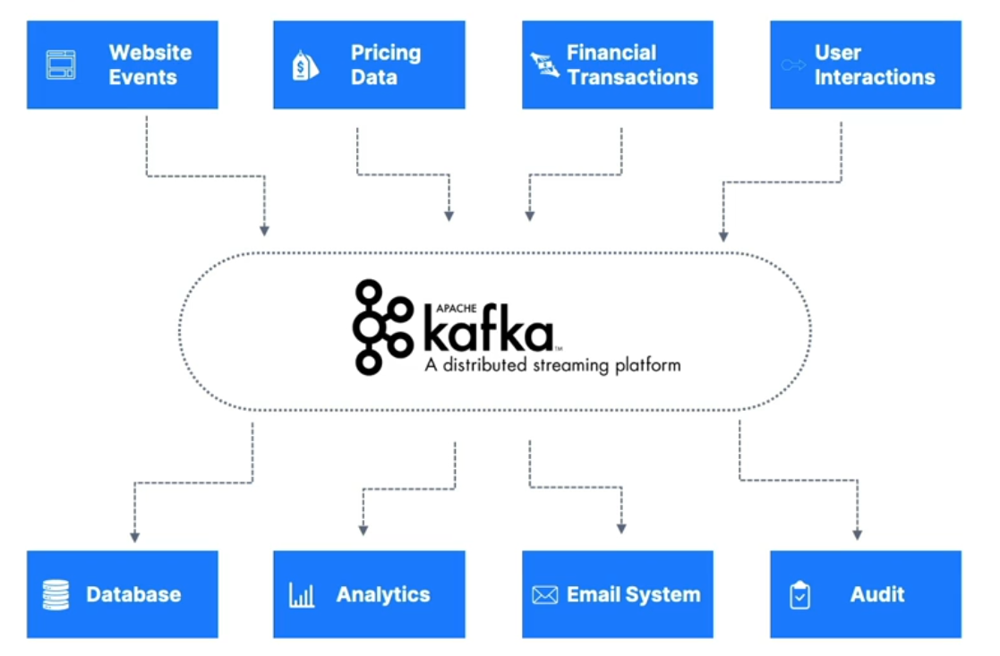

# apache-kafka

This project is mean to showcase basic use cases for Apache Kafka. Kafka is often used when there is a source 
system and data needs to move to a target system. At first this is easy since there is usually one of each but
as systems interdependency grows, this can lead to a tangled web. This is where Kafka comes in to help decouple data 
streams between systems and reduce system integrations. A good example from Conduktor is shown below:

## Kafka Theory
* Kafka contains immutable topics which are a particular stream of data (logs, purchases, tweets, gps points...) which are 
identified by their name.
* Sequence of messages is called a data stream
* Kafka producers send data to a topic and Kafka consumers read the data from a topic
* Topics can be partitioned which contain guaranteed ordered messages that are identified by their incremented id (offset).
Which topic data is sent to is random unless a key is provided.
* Data is kept by default for one week but can be configured.

## Producers & Message Keys
* Producers write data to topics
  * Know which partition to write to and which broker has it
  * Automatically recover in broker failures
* Producers can send a key with a message
  * Can be a string, number, binary, etc
  * Null keys are sent round-robin. When key is set, all messages with that key are sent to same partition.
  * Keys are good for message ordering
* Message anatomy
  * key/value | compression type | headers (optional) | partition + offset | timestamp
* Message serializer accepts bytes as input and output. The serializer converts to binary.

## Consumers & Deserialization
* Read data from a topic - pull model
* Automatically know which broker to read from and recover from failures
* Data read in order from low to high offset within each partition
* Deserialize bytes into objects/data
* Serialization/deserialization cannot change during a topic lifecycle. Create a new topic instead.

## Consumer Groups & Offsets
* All consumers in an application read data as a consumer group
* Each consumer within a group reads from exclusive partitions
  * This can lead to be inactive consumers
  * can have multiple consumer groups on the same topic
* Consumer offsets are stored at which a consumer group has been reading
  * This is helpful for when a consumer dies
  * Default is to commit offsets in at least once mode - after message is processed
    * At least once
    * At most once
    * Exactly once

## Brokers and Topics
* Kafka cluster is composed of multiple brokers - brokers are servers. Each broker is identified by an ID
* Each broker contains certain topic partitions
* Bootstrapping to a broker connects to the entire cluster
* Topic partitions scale horizontally in brokers
* Each broker knows all brokers, topics, and partitions (metadata)

## Topic Replication
* Topics have a replication factor (usually 1 on local). This allows another broker to take over if one broker goes down.
* Only one broker can be a leader for a partition. Producers send data to the leader of a partition and Consumers _typically_ 
read from the leader.
* Each replica is referred to as an ISR (in-sync replica)

## Producer Acks & Topic Durability
* Producers can choose to receive acknowledgements of data writes
  * 0 - producer won't wait for ack
  * 1 - producer will wait for leader to ack
  * all - leader + replicas ack
* Topic durability can withstand N-1 brokers and still recover data

## Zookeeper
* Starting to become legacy but originally managed brokers
* Helps perform leader election for partitions
* Sends metadata updates to kafka
* Positioning to not having Zookeeper at all. Not production ready yet (likely 4.0 will be).
